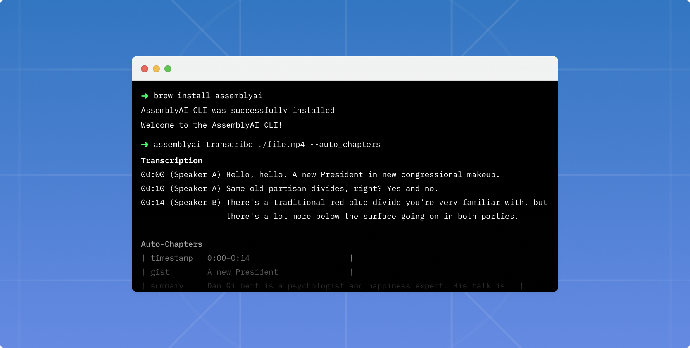

# AssemblyAI CLI


The AssemblyAI CLI helps you quickly test our latest AI models right from your terminal, with minimal installation required.



## Installation

The CLI is simple to install, supports a wide range of operating systems like macOS, Windows, and Linux, and makes it more seamless to build with AssemblyAI.

### Homebrew

If you're on macOS, you can install it using Homebrew:

```bash
brew tap assemblyai/assemblyai
brew install assemblyai
```

### macOS or Linux

If you don't have Homebrew installed, or are running Linux:

```bash
/bin/bash -c "$(curl -fsSL https://raw.githubusercontent.com/AssemblyAI/assemblyai-cli/main/install.sh)"
```

### Windows

The CLI is available on Windows either via Scool or by script. 

Via Scoop:

```powershell
scoop bucket add assemblyai https://github.com/assemblyai/scoop-assemblyai.git
scoop install assemblyai/assemblyai
````

Or via PowerShell as an administrator:

```powershell
Set-ExecutionPolicy RemoteSigned -Scope CurrentUser
irm https://raw.githubusercontent.com/AssemblyAI/assemblyai-cli/main/install.ps1 | iex
New-Alias -Name assemblyai -Value $Env:Programfiles/AssemblyAI/assemblyai.exe
```

## Getting started

Get started by configuring the CLI with your AssemblyAI token. If you don't yet have an account, create one [here](https://app.assemblyai.com/).

```bash
assemblyai config [token]
```

This command will validate your account, and store your token safely in `~/.config/assemblyai/config.toml` later to be used when transcribing files.

You can now transcribe local files, remote URLs, or YouTube videos.

```bash
assemblyai transcribe https://youtu.be/0wvBu014E5o --auto_highlights --entity_detection
```

## Usage

Installing the CLI provides access to the `assemblyai` command:

```bash
assemblyai [command] [--flags]
```

## Commands

### Transcribe

With the CLI, you can transcribe local files, remote URLs, and YouTube links.

```bash
assemblyai transcribe [local file | remote url | youtube links] [--flags]
```

<details>
  <summary>Flags</summary>
  
  > **-j, --json**  
  > default: false  
  > example: `-j` or `--json`  
  > If true, the CLI will output the JSON.

> **-p, --poll**  
> default: true  
> example: `-p` or `--poll`  
> The CLI will poll the transcription every 3 seconds until it's complete.

> **-s, --auto_chapters**  
> default: false  
> example: `-s` or `--auto_chapters`  
> A "summary over time" for the audio file transcribed.

> **-a, --auto_highlights**  
> default: false  
> example: `-a` or `--auto_highlights`  
> Automatically detect important phrases and words in the text.

> **-c, --content_moderation**  
> default: false  
> example: `-c` or `--content_moderation`  
> Detect if sensitive content is spoken in the file.

> **-d, --dual_channel**  
> default: false  
> example: `-d` or `--dual_channel`  
> Enable dual channel

> **-e, --entity_detection**  
> default: false  
> example: `-e` or `--entity_detection`  
> Identify a wide range of entities that are spoken in the audio file.

> **-f, --format_text**  
> default: true  
> example: `-f=false` or `--format_text=false`  
> Enable text formatting

> **-u, --punctuate**  
> default: true  
> example: `-u=false` or `--punctuate=false`  
> Enable automatic punctuation

> **-r, --redact_pii**  
> default: false  
> example: `-r` or `--redact_pii`  
> Remove personally identifiable information from the transcription.

> **-i, --redact_pii_policies**  
> default: drug,number_sequence,person_name  
> example: `-i medical_process,nationality` or `--redact_pii_policies medical_process,nationality`  
> The list of PII policies to redact ([source](https://www.assemblyai.com/docs/audio-intelligence#pii-redaction)), comma-separated. Required if the redact_pii flag is true.

> **-x, --sentiment_analysis**  
> default: false  
> example: `-x` or `--sentiment_analysis`  
> Detect the sentiment of each sentence of speech spoken in the file.

> **-l, --speaker_labels**  
> default: true  
> example: `-l=false` or `--speaker_labels=false`  
> Automatically detect the number of speakers in the file.

> **-t, --topic_detection**  
> default: false  
> example: `-t` or `--topic_detection`  
> Label the topics that are spoken in the file.

> **-w, --webhook_url**  
> example: `--webhook_url "https://example.com/"`  
> Receive a webhook once your transcript is complete.

> **-b, --webhook_auth_header_name**  
> example: `--webhook_auth_header_name "Authorization"`  
> Containing the header's name which will be inserted into the webhook request.

> **-o, --webhook_auth_header_value**  
> example: `--webhook_auth_header_value "foo:bar"`  
> Receive a webhook once your transcript is complete.

> **-n, --language_detection**  
> default: false  
> example: `-n` or `--language_detection`  
> Automatic identify the dominant language that’s spoken in an audio file.
> [Here](https://www.assemblyai.com/docs/core-transcription#automatic-language-detection) you can view the ALD list for supported languages

> **-g, --language_code**  
> example: `-g es` or `--language_code es`  
> Manually specify the language of the speech in your audio file.
> Click [here](https://www.assemblyai.com/docs#supported-languages) to view all the supported languages

> **-m, --summarization**  
> default: false  
> example: `-m` or `--summarization`  
> Generate a single abstractive summary of the entire audio.

> **-y, --summary_type**
> default: bullets  
> example: `-y paragraph` or `--summary_type paragraph`  
> Type of summary generated.
> Click [here](https://www.assemblyai.com/docs/audio-intelligence#summarization) to view all the supported types

</details>

### Get

If you're not polling the transcription, you can fetch it later:

```bash
assemblyai get [id]
```

<details>
  <summary>Flags</summary>
  
  > **-j, --json**  
  > default: false  
  > example: `--json` or `--json=true`  
  > If true, the CLI will output the JSON.

> **-p, --poll**  
> default: true  
> example: `--poll=false`  
> The CLI will poll the transcription every 3 seconds until it's complete.

</details>

## Contributing

We're more than happy to welcome new contributors. If there's something you'd like to fix or improve, start by [creating an issue](https://github.com/AssemblyAI/assemblyai-cli/issues). Please make sure to follow our [code of conduct](https://github.com/AssemblyAI/assemblyai-cli/blob/main/CODE_OF_CONDUCT.md).

## Telemetry

The AssemblyAI CLI includes a telemetry feature that collects usage data, and is enabled by default.

To opt out of telemetry, set the telemetry variable in the `config.toml` file to false.

## Upgrade

Our team regularly releases updates to ensure world-class service, so make sure to update your CLI when a new release is available. You can do so by running the same commands as shown on the [Installation](#installation) section, or, if you've installed using brew, run:

```bash
brew upgrade assemblyai
```

## Feedback

Please don't hesitate to [let us know what you think](https://forms.gle/oQgktMWyL7xStH2J8)!

## Uninstall

```bash
/bin/bash -c "$(curl -fsSL https://raw.githubusercontent.com/AssemblyAI/assemblyai-cli/main/uninstall.sh)"
```

We'd love to understand why you're uninstalling the CLI, and what we can do to improve it. Feel free to [reach out](https://forms.gle/oQgktMWyL7xStH2J8).

## License

Copyright (c) AssemblyAI. All rights reserved.

Licensed under the [Apache License 2.0 license](https://github.com/AssemblyAI/assemblyai-cli/blob/main/LICENSE).
